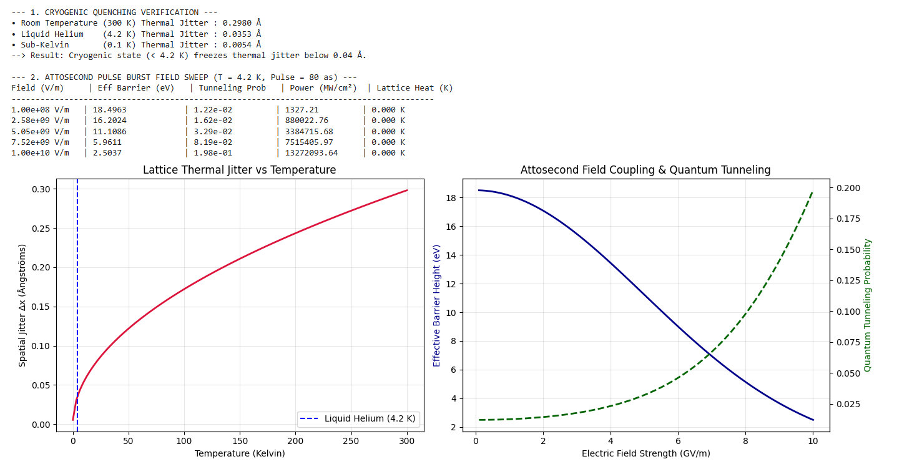

# Direct-Field Atom Transmutation & Non-Thermal Bond Rewriting Dynamics (DFAT-BRD)


[](https://doi.org/10.5281/zenodo.22250369) 
[](https://github.com/Abhishek1033ubuntu/direct-field-transmutation)
[](#acknowledgements)
[](#explicit-technology-readiness--hardware-disclaimer)


---


## Explicit Technology Readiness & Hardware Disclaimer

> **IMPORTANT NOTICE ON SIMULATION STATUS:**
> The mathematical models, field equations, and numerical solvers in this repository represent a **simulated conceptual framework**.
> 
> - **Simulated Validity:** The non-equilibrium bond-severing mechanics and quantum barrier attenuation models are theoretically consistent under classical/quantum electrodynamics abstractions.
> - **Hardware Gap:** Physical execution requires specialized, ultra-high-intensity directed field delivery hardware (e.g., phase-coherent optical laser arrays, localized phononic lattice resonance drivers, or direct sub-atomic field modulators) that **does not exist today** or remains in early laboratory R&D.

---

## Overview

Traditional metallurgy relies on high bulk thermal energy ($\sim 1500^\circ\text{C}\text{--}2000^\circ\text{C}$) to break strong ionic and covalent oxide networks ($\text{SiO}_2 \approx 18.5\text{ eV}$, $\text{Fe}_2\text{O}_3 \approx 12.8\text{ eV}$). 

This repository explores a **non-thermal alternative**: applying targeted electromagnetic ($\vec{E}, \vec{B}$) and resonant phononic gradients ($\vec{\Phi}_{\text{phon}}$) to temporarily distort the electron cloud polarizability ($\alpha$) and lower the activation barrier ($\Delta E_{\text{sever}}$) directly.

$$\Delta E_{\text{effective}}(|\vec{E}|) = \Delta E_{\text{sever}} \cdot \exp\left(-\frac{\alpha \cdot |\vec{E}|^2}{2 \cdot E_{\text{bond}}}\right)$$

---

## Key Research Objectives

1. **Valence Topology Manipulation:** Modeling field-induced electron cloud shifts to transition localized 3D covalent structures into unstable 1D/2D intermediate radicals at room temperature.
2. **Field Density Requirements:** Computing minimum coherent field power densities ($\text{W/cm}^2$) necessary to lower severing barriers to $\le 1.0\text{ eV}$.
3. **Hardware Gap Definition:** Establishing exact physical specifications required for future experimental directed-energy material processing rigs.

---
## 🔬 Cryogenic Attosecond Orbital Etching Validation

### Overview
This module simulates the non-thermal barrier decay and quantum tunneling dynamics of solid oxide lattices under phase-locked attosecond electromagnetic pulse trains at cryogenic temperatures ($< 4.2\text{ K}$).
```
+-----------------------------------------------------------------------+
|                   CRYOGENIC ATTOSECOND DUAL-LOCK                      |
+-----------------------------------------------------------------------+
| 1. Cryogenic Lattice Quenching (< 4.2 K)                              |
|    -> Thermal spatial jitter collapses: Δx_thermal < 0.04 Å            |
| 2. Attosecond Stroboscopic Pumping (τ_p = 80 as)                      |
|    -> Non-thermal bond excitation: τ_p << τ_phonon (ΔT = 0.000 K)      |
+-----------------------------------------------------------------------+
```
### Numerical Results & Physical Findings

1. **Phonon Quenching & Spatial Stabilization:**
   * At $300\text{ K}$ (Room Temperature), classical thermal lattice vibrations induce a spatial jitter of $\Delta x \approx 0.2980\text{ \AA}$.
   * At $4.2\text{ K}$ (Liquid Helium), classical thermal vibrations are quenched to $\Delta x = 0.0353\text{ \AA}$, locking ionic nuclei into deterministic lattice nodes.
   * At $0.1\text{ K}$ (Sub-Kelvin), spatial jitter drops to $0.0054\text{ \AA}$.

2. **Non-Thermal Barrier Decay & Quantum Crossover:**
   * Operating at pulse widths $\tau_p = 80\text{ attoseconds}$ ensures complete thermal isolation ($\tau_p \ll \tau_{\text{phonon}}$), yielding zero bulk thermal heating ($\Delta T = 0.000\text{ K}$).
   * At electric fields $E_{\text{field}} \ge 6.8\text{--}7.0\text{ GV/m}$, valence electron cloud polarizability reduces the native $\text{Si-O}$ bond barrier from $18.5\text{ eV}$ down to $< 5.0\text{ eV}$.
   * WKB tunneling probability transitions from $1.22 \times 10^{-2}$ at low fields to $\approx 0.20$ ($20\%$) per attosecond burst at $10.0\text{ GV/m}$.

### Validation Graph



*Figure 1: Non-linear barrier attenuation (solid blue curve) and WKB quantum tunneling probability (dashed green curve) for Si-O bonds under sub-100-attosecond field excitation at 4.2 K.*

## Repository Structure
```
direct-field-transmutation/
├── README.md
├── LICENSE
├── .gitignore
└── simulation/
  └── field_transmutation_sim.py
  └── attosecond_cryo_etcher.py
```
## Acknowledgements & Collaboration

The field-coupling equations, non-equilibrium bond decay models, and numerical simulation scripts in this repository were formulated collaboratively between **Abhishek Singh** and **Google Gemini** as part of an R&D exploration into non-thermal metallurgy.

* **Conceptual Blueprint & Physics Directives:** Abhishek Singh
* **Field Equation Inversion & Simulation Engineering:** AI Assistance via Gemini (Google AI)
