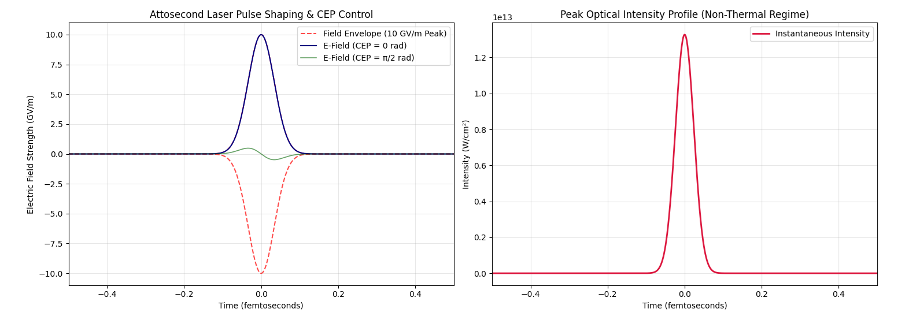

# ⚡ Non-Thermal Photonic Processing Engine (`non-thermal-photonic-processing`)

## Overview
The **Non-Thermal Photonic Processing Engine** models attosecond pulse shaping, Carrier-Envelope Phase (CEP) locking, and optical intensity profiles required to physicalize electric field strengths from $0.1\text{--}10.0\text{ GV/m}$ in real time.

---

## 📐 Mathematical Formulation

The electric field temporal profile $E(t)$ and instantaneous intensity profile $I(t)$ are modeled as:

$$E(t) = E_0 \cdot \exp\left( -4 \ln(2) \left[\frac{t}{\tau}\right]^2 \right) \cdot \cos(\omega_0 t + \phi_{\text{CEP}})$$

$$I(t) = \frac{1}{2} \varepsilon_0 c |E(t)|^2$$

Where:
* $E_0$: Peak electric field strength ($10.0\text{ GV/m}$)
* $\tau$: Pulse duration FWHM ($80\text{ attoseconds}$)
* $\omega_0$: Central drive frequency ($800\text{ nm}$ Ti:Sapphire drive)
* $\phi_{\text{CEP}}$: Carrier-Envelope Phase offset ($0$ to $\pi/2\text{ rad}$)

---

## 📊 Pulse & Intensity Analysis

### Key Performance Metrics
* **Peak Electric Field ($E_{\text{peak}}$):** $10.0\text{ GV/m}$
* **Peak Intensity ($I_{\text{peak}}$):** $1.327 \times 10^{13}\text{ W/cm}^2$
* **Pulse Duration ($\tau_{\text{FWHM}}$):** $80\text{ attoseconds}$ ($0.08\text{ fs}$)
* **Thermal Response Time ($\tau_{\text{phonon}}$):** $> 100\text{ fs}$ (Ensures zero-thermal heating, $\Delta T = 0.000\text{ K}$)
